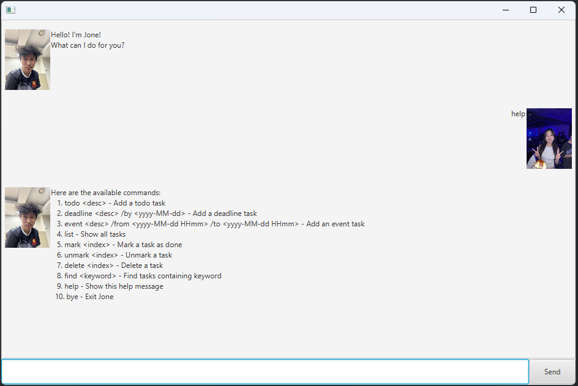

# Jone User Guide


Jone is a desktop application for managing your personal tasks, optimized for use via a simple chat-like interface.

It allows you to quickly add, edit, and keep track of different types of tasks such as todos, deadlines, and events.
Unlike traditional task managers that rely heavily on buttons and menus, Jone is designed for users who prefer typing commands.
It is lightweight, easy to use, and ensures that you stay on top of your tasks with minimal effort.

## Quick Start

1. Ensure you have Java 11 or above installed.

2. Download the latest jone.jar release from the most recent JAR release

3. Copy the file to the folder you want to use as the home folder.

4. Open a terminal, cd into the folder, and run:
```
java -jar Jone.jar
```
5. A GUI similar to above should appear in a few seconds
6. Type a command in the input box and press Enter to execute it

## Commands

### Adding todos

Create a simple task without a date

Format: `todo <description>`

Example: `todo read book`

Expected Output:
```
Got it. I've added this task:
[T][ ] read book
Now you have 1 task in the list.
```

### Adding deadlines

Add a task with a due date

Format: `deadline <description> /by <yyyy-MM-dd>`

Example: `deadline submit homework /by 2025-09-20`

Expected Output:
```
Got it. I've added this task:
[D][ ] submit homework (by: Sep 20 2025)
Now you have 2 tasks in the list.
```

### Adding events

Add a task with a start and end time

Format: `event <description> /from <yyyy-MM-dd HHmm> /to <yyyy-MM-dd HHmm>`

Example: `event project meeting /from 2025-09-21 1400 /to 2025-09-21 1600`

Expected Output:
```
Got it. I've added this task:
[E][ ] project meeting (from: 2025-09-21 1400 to: 2025-09-21 1600)
Now you have 3 tasks in the list.
```

### Listing all tasks

Shows a list of all tasks currently in Jone

Command: `list`

### Marking a task as done

Marks the specified task as completed

Command: `mark <index>`

### Unmarking a task

Unmarks the specified task

Command: `unmark <index>`

### Deleting a task

Deletes the specified task from the list

Command: `delete <index>`

### Finding tasks

Finds tasks that contains the given keyword

Command: `find <keyword>`

### Viewing help

Shows a list of available commands

Command: `help`

### Exiting the program

Exits Jone

Command: `bye`